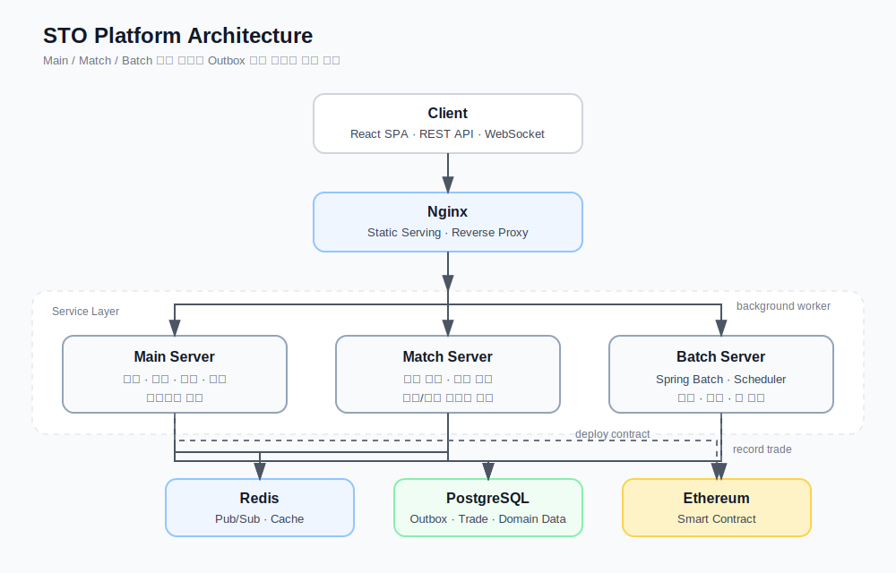

# STO Platform

> 실물 자산을 블록체인 기반 증권형 토큰(Security Token)으로 발행하고, 주식 거래소와 유사한 방식으로 거래·정산·관리할 수 있는 STO 거래 플랫폼


<br>

## 프로젝트 개요

STO Platform은 부동산, 조각 투자 상품과 같은 실물 자산을 토큰화하고, 사용자가 해당 토큰을 실시간으로 매수·매도할 수 있도록 만든 증권형 토큰 거래 플랫폼입니다.

일반적인 CRUD 서비스가 아니라 **주문 접수, 호가 관리, 매칭, 체결 이벤트 전파, 캔들 집계, 배당 정산, 블록체인 기록**까지 포함한 거래 시스템 흐름을 구현하는 데 초점을 맞췄습니다. 프론트엔드는 거래소 형태의 사용자 경험을 제공하고, 백엔드는 Main / Match / Batch 애플리케이션으로 책임을 분리해 주문 처리와 비동기 작업의 영향을 줄이도록 설계했습니다.

<br>

## 핵심 기능

| 기능 | 설명 |
|---|---|
| **실시간 주문·체결** | 매수/매도 주문 접수, 주문 취소, 독립 매칭 엔진을 통한 체결 처리 |
| **호가창·체결 이벤트** | Redis Pub/Sub와 WebSocket(STOMP)을 이용한 실시간 주문/체결 데이터 브로드캐스트 |
| **캔들 차트** | 1분·1시간·1일·1개월·1년 단위 OHLCV 데이터 집계 및 조회 |
| **블록체인 기록** | 토큰 발행 및 체결 결과를 Ethereum 스마트 컨트랙트와 연동해 기록 |
| **배당 정산** | 토큰 보유량 기반 배당금 계산, 지급 이력 관리 |
| **포트폴리오** | 보유 토큰, 주문 내역, 입출금 내역, 배당 내역 조회 |
| **관심 종목·알림** | 관심 토큰 등록과 사용자 알림 관리 |
| **공시·공지** | 발행사 공시 문서와 플랫폼 공지사항 관리 |
| **AI 뉴스 인사이트** | Gemini API와 Naver News API 기반 자산별 뉴스 요약 |
| **관리자 대시보드** | 사용자, 자산, 수익, 정산, 로그, 공시/공지 관리 |

<br>

## 상세 기능

### 거래 및 체결

- 매수/매도 주문 접수, 주문 취소, 미체결 주문 조회
- Main 서버에서 주문 요청을 검증하고 Match 서버로 매칭 요청 전달
- Match 서버에서 주문장(Order Book) 기반 매칭 처리
- 체결 결과를 Redis Pub/Sub으로 발행하고 WebSocket(STOMP)으로 클라이언트에 전달
- 매칭 실패 또는 응답 실패 주문에 대한 재시도 흐름 관리

### 실시간 시세와 차트

- 실시간 호가창, 체결 내역, 대기 주문 이벤트 제공
- 1분·1시간·1일·1개월·1년 단위 캔들 데이터 조회
- 체결 이벤트 발생 시 캔들 데이터를 갱신하고 WebSocket으로 실시간 반영
- React 화면에서 차트, 호가, 주문 패널을 거래소 형태로 구성

### 블록체인 연동

- 자산 등록 시 Solidity 스마트 컨트랙트 기반 토큰 배포
- Web3j를 이용해 Java 애플리케이션에서 Ethereum RPC 직접 호출
- 체결 결과를 Blockchain Outbox Queue에 저장한 뒤 Batch 서버에서 온체인 기록 처리
- 트랜잭션 해시, 컨트랙트 주소, 가스 사용량, 성공/실패 상태 저장
- 온체인 기록 실패 시 재시도 및 실패 상태 관리

### 배당 정산과 배치 처리

- Spring Batch와 Scheduler 기반 주기 작업 수행
- 토큰 보유량 기준 배당 대상자 산정
- 회원 계좌, 플랫폼 계좌, 배당 지급 이력 갱신
- 토큰 상장 예정 상태를 거래 가능 상태로 전환
- 블록체인 Outbox Queue를 읽어 온체인 기록 작업 처리

### 사용자 기능

- 회원가입, 로그인, JWT 기반 인증
- 보유 토큰, 평가 금액, 실현/미실현 손익 조회
- 주문 내역, 체결 내역, 입출금 내역, 배당 내역 조회
- 관심 종목 등록 및 알림 조회
- 자산별 공시, 공지, AI 뉴스 요약 확인

### 관리자 기능

- 회원, 자산, 토큰, 플랫폼 계좌 관리
- 자산 등록 시 토큰 발행 및 컨트랙트 주소 저장
- 공시, 공지, 배당 이벤트 등록/수정/조회
- 거래량, 거래대금, 플랫폼 수익, 정산 상태 조회
- 시스템 로그와 실시간 정산 흐름 모니터링

<br>

## 시스템 아키텍처



Batch 서버는 사용자 요청을 직접 받지 않는 백그라운드 애플리케이션입니다. 블록체인 연동은 DB에 상태를 저장한 뒤 Main 서버의 컨트랙트 배포 또는 Batch 서버의 온체인 기록 작업에서 Web3j로 Ethereum RPC를 직접 호출하는 흐름입니다.

<br>

## 기술 스택

**Backend**

| 분류 | 기술 |
|---|---|
| 언어 / 런타임 | Java 21 |
| 프레임워크 | Spring Boot 3.5.x, Spring Security, Spring Batch |
| 데이터 접근 | JPA/Hibernate, QueryDSL, MyBatis |
| 인증 | JWT |
| 실시간 통신 | Spring WebSocket(STOMP), SockJS |
| 메시징 / 캐시 | Redis Pub/Sub, Redis Cache |
| 매핑 | MapStruct |
| 블록체인 | Web3.j 4.14, Solidity, Hardhat, OpenZeppelin v5 |
| 외부 API | Google Gemini AI, Naver News API |
| 문서화 | SpringDoc OpenAPI(Swagger) |

**Frontend**

| 분류 | 기술 |
|---|---|
| 프레임워크 | React 19, Vite 6 |
| 스타일링 | Tailwind CSS 4 |
| 라우팅 | React Router v7 |
| HTTP | Axios |
| 실시간 | STOMP.js, SockJS |
| 차트 | Recharts |

**Infra / DevOps**

| 분류 | 기술 |
|---|---|
| 데이터베이스 | PostgreSQL, Redis 7 |
| 컨테이너 | Docker, Docker Compose |
| 웹서버 | Nginx |
| CI/CD | Jenkins |

<br>

## 프로젝트 구조

```text
STO/
├── client/
│   └── web/                         # React SPA
│       └── src/
│           ├── pages/               # 거래, 대시보드, 마이페이지, 관리자 화면
│           ├── components/          # 공통 UI, 거래 화면 컴포넌트
│           ├── hooks/               # WebSocket, 상태 연동 훅
│           ├── context/             # 전역 상태
│           └── lib/                 # API, 설정, 유틸
│
├── server/
│   ├── main/                        # Main API 서버
│   │   ├── src/main/java/server/main/
│   │   │   ├── auth/                # 인증 · JWT
│   │   │   ├── member/              # 회원 · 지갑 · 계좌
│   │   │   ├── order/               # 주문 접수 · 취소 · 재시도
│   │   │   ├── trade/               # 체결 내역
│   │   │   ├── token/               # 토큰 목록 · 상세 · AI 요약
│   │   │   ├── asset/               # 실물 자산
│   │   │   ├── candle/              # 캔들 데이터
│   │   │   ├── myAccount/           # 포트폴리오 · 입출금
│   │   │   ├── allocation/          # 배당 정산 조회
│   │   │   ├── blockchain/          # Web3.j 연동 · Outbox Queue
│   │   │   ├── disclosure/          # 공시
│   │   │   ├── notice/              # 공지
│   │   │   ├── admin/               # 관리자 기능
│   │   │   └── global/              # 공통 설정 · 보안 · 예외 · 파일 · WebSocket
│   │   └── sto-contracts/           # Solidity 스마트 컨트랙트
│   │
│   ├── match/                       # 주문 매칭 엔진
│   │   └── src/main/java/server/match/
│   │       ├── order/               # 주문장 · 매칭 로직 · 체결 이벤트
│   │       └── global/              # Redis, 예외, 설정
│   │
│   └── batch/                       # 배치 애플리케이션
│       └── src/main/java/server/batch/
│           ├── allocation/          # 배당 정산 Batch
│           ├── blockchain/          # 블록체인 기록 Queue 처리
│           └── token/               # 토큰 상장 스케줄러
│
├── nginx/                           # Nginx 설정 및 프론트엔드 빌드 이미지
├── docker-compose.yml
├── Jenkinsfile
├── README.dev.md
└── .env.example
```

<br>

## CI/CD 파이프라인

Jenkins는 SCM 변경을 주기적으로 감지해 다음 흐름으로 배포를 수행합니다.

1. Git checkout
2. Main / Match / Batch / Nginx Docker 이미지 빌드
3. 빌드된 이미지를 tar 파일로 저장
4. 운영 서버로 이미지와 `docker-compose.yml` 전송
5. 운영 서버에서 Docker 이미지 로드
6. `.env`의 `IMAGE_TAG` 갱신
7. `docker compose up -d`로 서비스 재기동

<br>

## 개발 컨벤션

팀 코드 규칙(BaseEntity, DTO 검증, MapStruct, 변경 감지, 전역 예외 처리 등)은 [README.dev.md](./README.dev.md)를 참고하세요.
